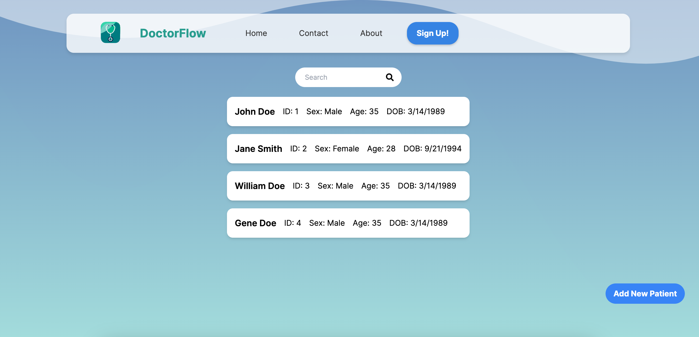
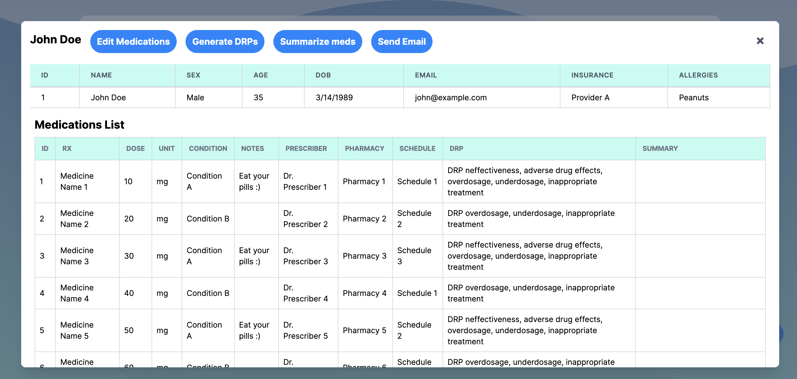

# Doctor Flow (LA Hacks 2024)
Doctor Flow is a web app aimed at improving the process of medication management and communication between doctors and patients. Doctor Flow utilizes Google Gemini to provide medication summaries and identify potential drug-related issues, ensuring efficient and safe healthcare delivery.

## Features
- Drug Interaction Checker: Identifies potential conflicting drug interactions, preventing adverse effects such as allergic reactions.
- Medication Summaries: Creates simplified summaries for each medication, enabling patients to easily understand the purpose and essential details of their prescriptions.
- Medication Reminders: Automatically adds medication schedules as events to the patient's Google Calendar, ensuring they never miss a dose.

## Landing Page
- Displays a list of patients currently under the care of the logged-in provider.
- Includes a search bar that allows users to filter for patients using various criteria, such as name or patient ID. 

## Medication Page
- Enables healthcare providers to modify patient medication details, identify potential drug-related issues, summarize medication lists, and securely email patients their medication summaries and alerts.
- Includes a medication table that displays detailed information about a patient's prescriptions, including medication summaries and any drug-related problems.
